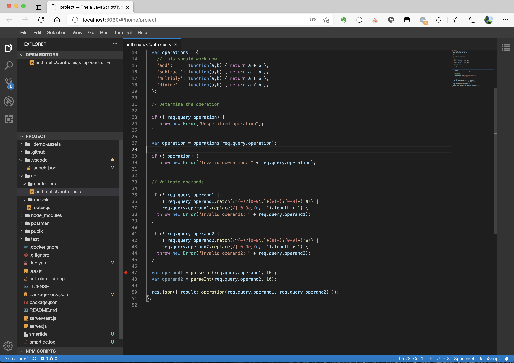
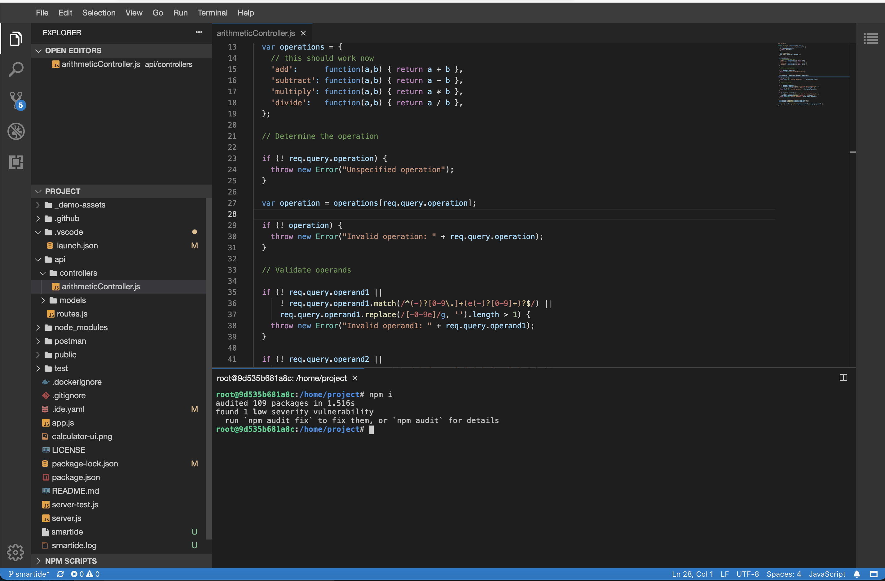
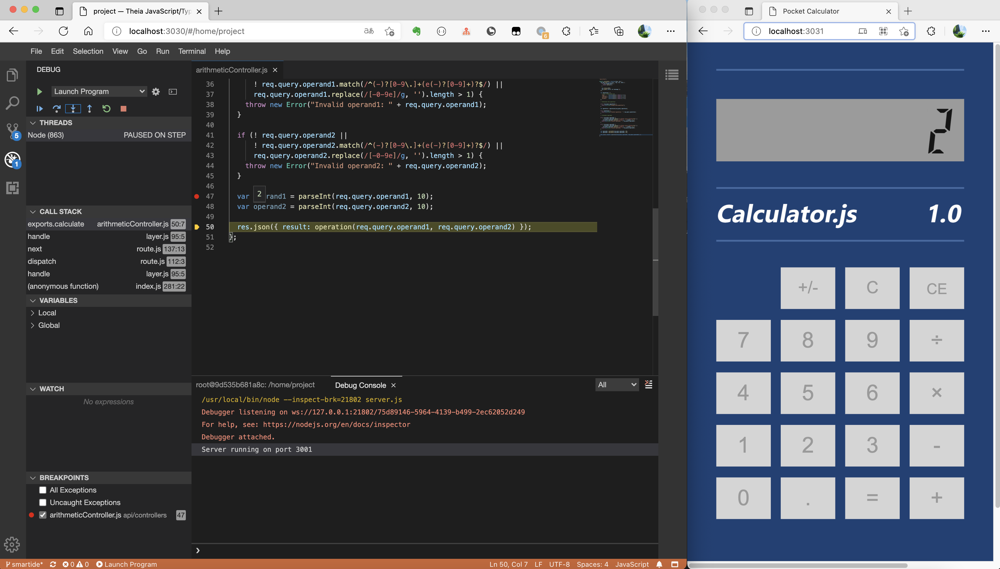
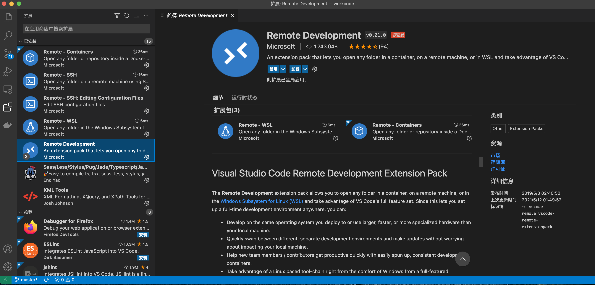
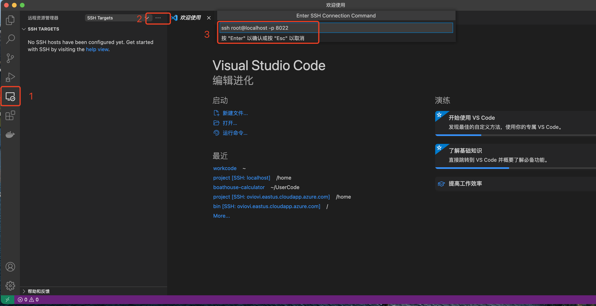
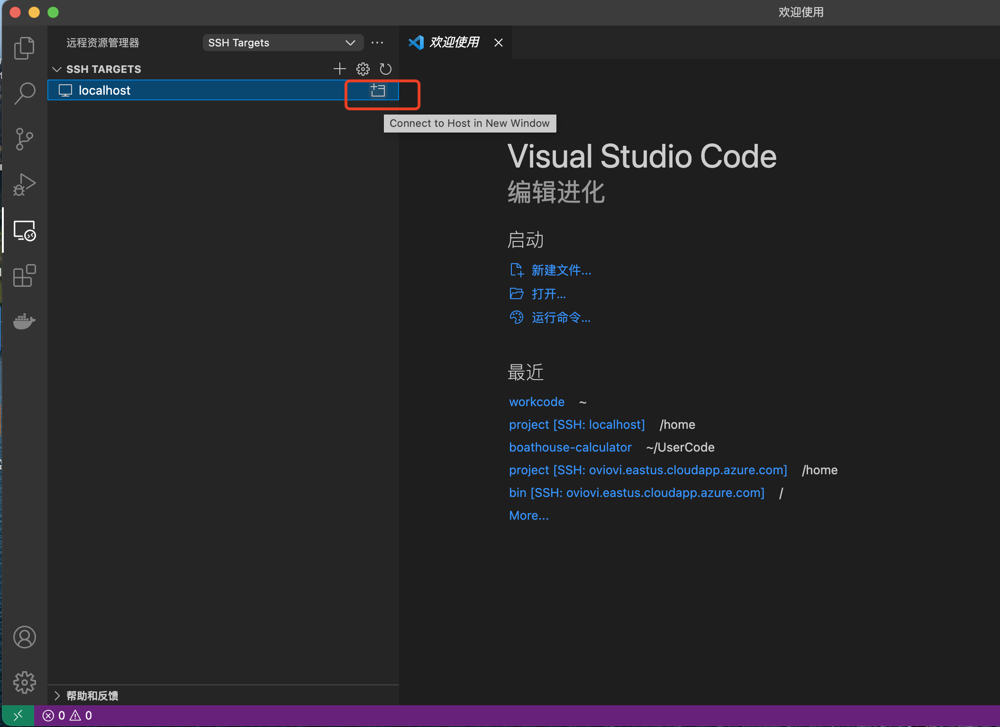
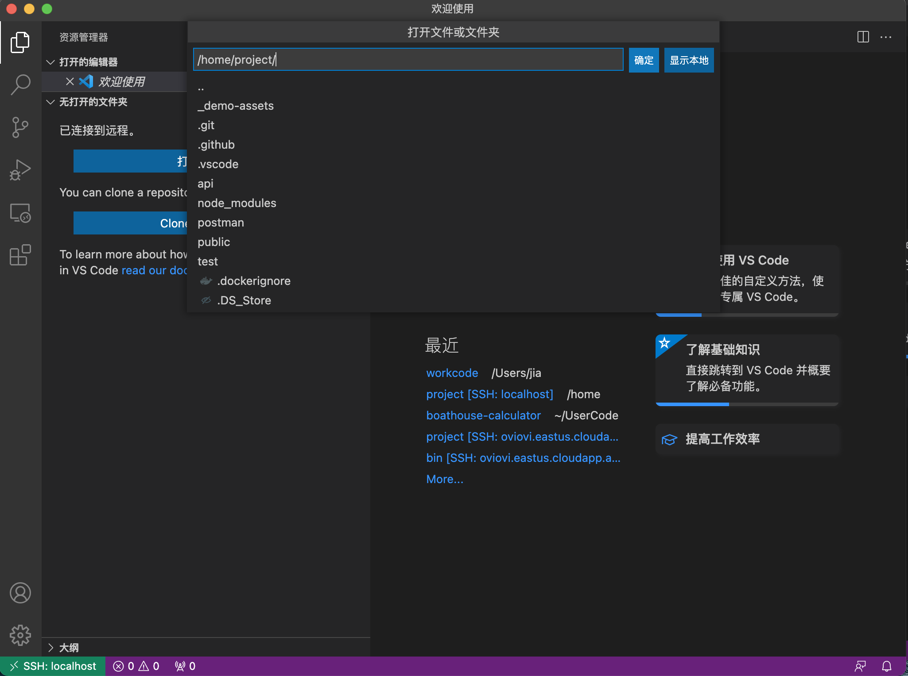
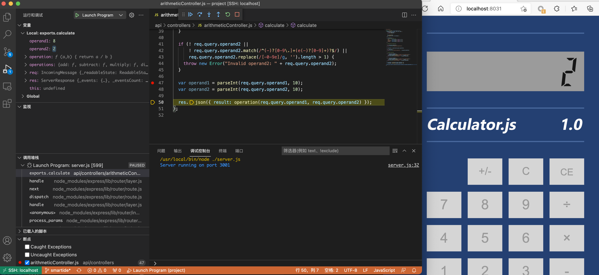
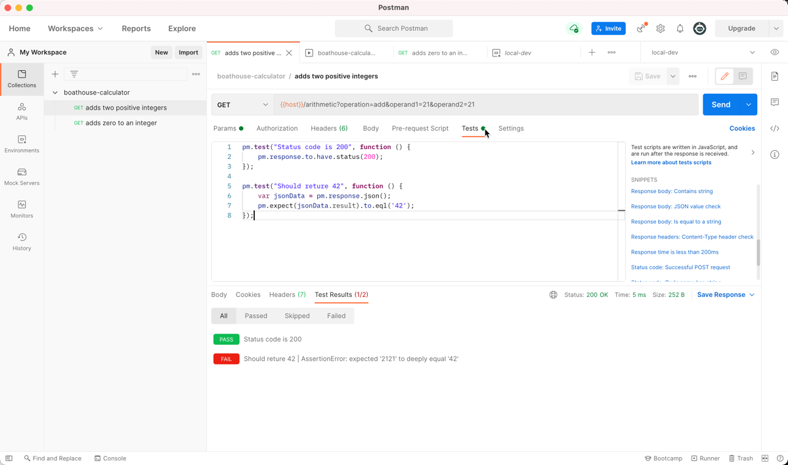

# Calculator.js:  node.js 演示项目   

test 

本应用使用node.js创建，并包含了试用mocha的单元测试代码。本应用的运行状态为网页中的计算器，如下图：


代码中使用node.js代码提供了REST APIs，其中提供各种数学计算功能单元。

使用mocah编写的测试代码可以完成所有以上API内部运算运算逻辑的验证，最终使用 `mocha-junit-reports` 来生成XML格式的测试结果文件以便 [Azure DevOps](https://azure.com/devops) 可以读取测试结果提供DevOps流水线的测试集成。

## 本地构建本项目的方式

1. 运行 `npm install` 安装所有依赖包
2. 运行 `npm test` 运行所有测试
3. 运行 `npm start` 启动应用，并打开 http://localhost:3000

使用Docker构建和运行项目的方式：

1. 复制 _demo-assets/demo-dockerfile 到根目录下的Dockerfile文件

2. 运行以下命令完成 `calculator` 容器构建打包

```shell
docker build -t calculator .
```

2. 运行 `calculator` 容器

```shell
docker run -itd -p 8080:3000 calculator
```

打开 http://localhost:8080 

应用启动后的状态如上图。

## Smartide 本地运行
1. 安装smartide

安装SmartIDE，参考链接: https://smartide.dev/zh/docs/getting-started/install/

2. 在boathouse-calculator目录运行 `smartide start` 命令启动开发容器，自动打开 http://localhost:3030

```shell
git clone https://github.com/idcf-boat-house/boathouse-calculator.git
cd boathouse-calculator
smartide start
```



3. 运行和调试
   1.  Terminal > New Terminal 打开命令行窗口，`npm i`安装依赖包
   
   2. 运行项目，打开http://localhost:3031 ,设置断点调试
   


## Visual Studio Code Remote Development

**说明：** 当前对VSCode Remote SSH的支持还没有集成到 smartide cli，中，请通过以下命令手工启动 smartide开发容器 并按照后续配置使用VSCode Remote SSH 进入容器进行开发调试。

```shell
cd boathouse-calculator
docker-compose -f docker-compose-smartide.yaml up
```

1. 安装插件：Remote Development



2. 新建SSH连接并保存到配置文件



3. 打开SSH连接，中间需要多次输入密码



4. 打开远程容器目录



5. `npm i`安装依赖包，运行和调试




## SonaQube 运行

使用Docker容器的方式运行sonar-scanner-cli

将 sonar-project.properties 移动到根目录，然后运行一下命令

```shll
docker run \
    --rm \
    -e SONAR_HOST_URL="http://{SonaQubeServerUrl}" \
    -e SONAR_LOGIN="{Token}" \
    -v "${PWD}:/usr/src" \
    sonarsource/sonar-scanner-cli
```

## Run Postman Collection in Docker

使用PostMan编写和运行API测试



```shell
# install newman to run postman collections in command line https://www.npmjs.com/package/newman
npm install -g newman
# install newman-reporter-junit to export test report in juntest format https://www.npmjs.com/package/newman-reporter-junitfull
npm install -g newman-reporter-junitfull

## newman sample command
newman run postman/boathouse-calculator.postman_collection.json -e postman/local-dev.postman_environment.json

## newman sample command with junit report export
newman run postman/boathouse-calculator.postman_collection.json -e postman/local-dev.postman_environment.json -r junitfull --reporter-junitfull-export './postman/result.xml' -n 2
```

```shell
## run newman using the newman docker container
docker run -v "${PWD}/postman:/etc/newman" -t postman/newman:alpine run boathouse-calculator.postman_collection.json -e local-dev.postman_environment.json
## with junit format report 
docker run -v "${PWD}/postman:/etc/newman" -t postman/newman:alpine run boathouse-calculator.postman_collection.json -e local-dev.postman_environment.json --reporters junit --reporter-junit-export 'result-docker.xml'
```

