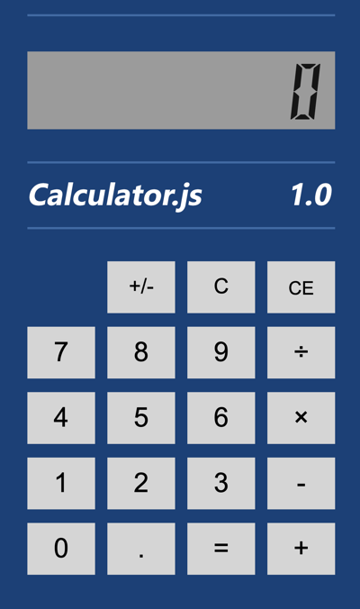

# Calculator.js: node.js 演示项目

本应用使用node.js创建，并包含了试用mocha的单元测试代码。本应用的运行状态为网页中的计算器，如下图：



代码中使用node.js代码提供了REST APIs，其中提供各种数学计算功能单元。

使用mocah编写的测试代码可以完成所有以上API内部运算运算逻辑的验证，最终使用 `mocha-junit-reports` 来生成XML格式的测试结果文件以便 [Azure DevOps](https://azure.com/devops) 可以读取测试结果提供DevOps流水线的测试集成。

本地构建本项目的方式：

1. 运行 `npm install` 安装所有依赖包
2. 运行 `npm test` 运行所有测试
3. 运行 `npm start` 启动应用，并打开 http://localhost:3000

使用Docker构建和运行项目的方式：

1. 运行以下命令完成 `calculator` 容器构建打包

```shell
docker build -t calculator .
```

2. 运行 `calculator` 容器

```shell
docker run -itd -p 8080:3000 calculator
```

打开 http://localhost:8080 

应用启动后的状态如上图。